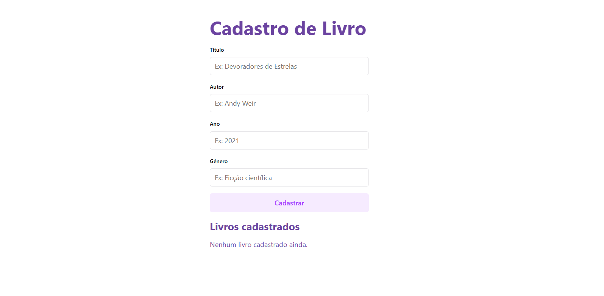

# ✦ Formulário de Cadastro de Livros em React ✦

Projeto desenvolvido para a disciplina de **Programação para Internet**, como atividade prática sobre **Componentes, Props e Estado com React**.

A aplicação apresenta um formulário para cadastro de livros, utilizando componentes reutilizáveis, `useState` para gerenciamento dos dados e renderização dinâmica da lista de livros cadastrados.

## ✧ Tecnologias Utilizadas

- React
- JavaScript
- CSS
- Vite

## ✧ Screenshot

### Formulário de Cadastro

## ✧ Funcionalidades

- Cadastro de livros através de um formulário
- Campos para título, autor, ano de publicação e gênero
- Uso de `useState` para controlar os campos
- Componentes reutilizáveis
- Renderização da lista de livros cadastrados
- Identificador próprio para cada livro
- Limpeza dos campos após o cadastro
- Mensagem exibida quando nenhum livro foi cadastrado

## ✧ Como Executar o Projeto

Clone o repositório:

    git clone URL_DO_REPOSITORIO

Acesse a pasta do projeto:

    cd exercicio-formulario

Instale as dependências:

    npm install

Execute o projeto:

    npm run dev

Após executar o comando, acesse no navegador o endereço informado pelo Vite, geralmente:

    http://localhost:5173

## ✧ Objetivo da Atividade

Desenvolver uma aplicação React de cadastro de livros, colocando em prática os conceitos de **componentes, props, estado com `useState` e renderização de listas**.
